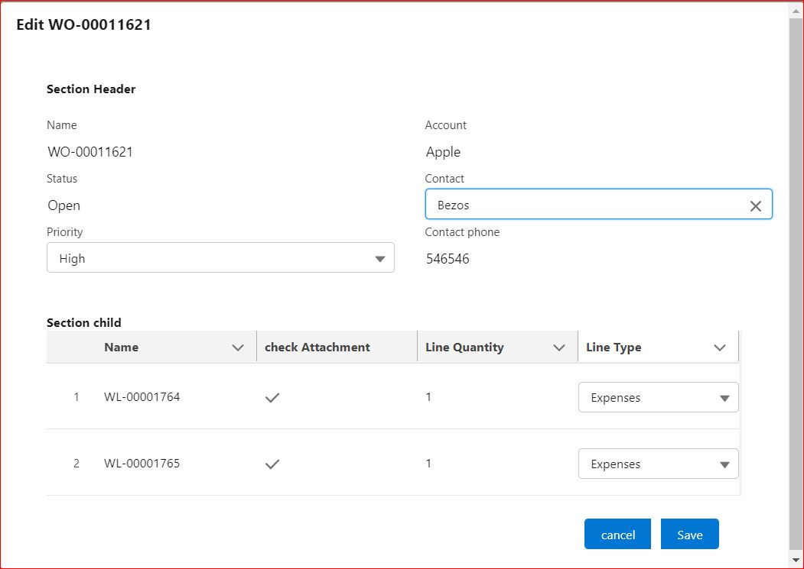

# List of Projects available in this Repo
1. svmx sfm_ui
2. Property finder

 
# DESCRIPTION SVMX SFM_UI : 

# Images : 

    

     Project Description : 
     This component is deployed as a custom action on a record Page ,which can be accessed as a quick action 
     It is used to update the record and their chid record .
     
     Functionality  :        As a end User ,user can update the header record and child record 
                             Header Record  : 
                             some of the field in header is Read Only and contact is a LookUp field 
                             where user can select any contact from the drop down once selected drop down 
                             will be disappeared and icon inside the contact Box is dynamic 
                             Chid Record : 
                             User will be able to get all the lines based On the sharing setting 
                             user can perform the inline editing to the child record and 
                             when user Click On the Save button ,the record will be saved 
                             and user can see the success Notification .
                             Validation : if user select the lineTypes 'parts' for the Child record 
                             then user will not allowd to save data and User recevies error Notification 
                           
     
     Concept Used  : ->
                             1.  custom LookUp field used 
                             2.  custom types in lightning dataTable (Picklist)
                             3.  custom validation 
                             4.  use Component as a quick Action 
                             5.  
 
     Component description : there are  total 4  LWC component Used to Developed the SFM_UI
                             1. WorkOrderCustomUI
                             2. ContactDropDown
                             3. ExtendedDataTable
                             4. ExtendedDataTableChildPickList
                             
      Apex classes :         there are 2 Apex class Used 
                             1. ContactManager 
                             2. WorkDetailsManager
                             
     static Resources Used : there are One static resource Used 
                            1. dataSty  (static Resources/dataSty.css)
     
     
    
    
    
# DESCRIPTION Property  Finder : 
     
     

